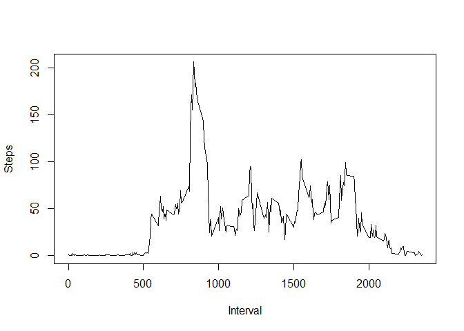

# Reproducible Research: Peer Assessment 1


## Loading and preprocessing the data

After cloning the GitHub repository github.com/rdpeng/RepData_PeerAssessment1 and extracting activity.zip, set the work directory to the folder with the extracted file and then read the csv file. Create another set excluding the rows with NA value.


```r
setwd("~/DataScience/Data/RepData_PeerAssessment1")
csvdata <- read.csv("activity.csv")
csvdataNoNA <- csvdata[!is.na(csvdata$steps),]
```

## What is mean total number of steps taken per day?
Sum the steps per each date and histogram the total steps per day


```r
StepsByDate <- aggregate( steps~date, csvdataNoNA, sum)
totalStepsPerDay <- StepsByDate$steps
hist(totalStepsPerDay)
```

 

<br>Mean total number steps per day is 10766.19 and median is 10765.

```r
mean(totalStepsPerDay)
```

```
## [1] 10766
```

```r
median(totalStepsPerDay)
```

```
## [1] 10765
```

## What is the average daily activity pattern?
Calculate average steps per interval and plot it.

```r
averageStepsByInterval <- aggregate( steps~interval, csvdataNoNA, mean)
plot(averageStepsByInterval$interval ,averageStepsByInterval$steps, type='l', ylab="Steps", xlab="Interval")
```

 
<br>835th 5-minute interval contains the maximum number of steps on average (206.1698)

```r
averageStepsByInterval[averageStepsByInterval$steps == max(averageStepsByInterval$steps),]
```

```
##     interval steps
## 104      835 206.2
```

## Imputing missing values

The total number NA values is 2304.

```r
csvdataNA <- csvdata[is.na(csvdata$steps),]
nrow(csvdataNA)
```

```
## [1] 2304
```
Creating a new data set in which the missing values are replaced by the mean for that 5-minute interval.


```r
for (i in 1:2304 ) {
csvdataNA[i, 1] <- averageStepsByInterval[averageStepsByInterval$interval == csvdataNA[i,3],2]
}
newcsvdata <- rbind(csvdataNA, csvdataNoNA)
```

Sum the steps per each date for the new set and histogram the total steps per day


```r
StepsByDateNew <- aggregate( steps~date, newcsvdata, sum)
totalStepsPerDayNew <- StepsByDateNew$steps
hist(totalStepsPerDayNew)
```

 

<br>Mean total number steps per day is 10766.19 and median is 10766.19.

```r
mean(totalStepsPerDayNew)
```

```
## [1] 10766
```

```r
median(totalStepsPerDayNew)
```

```
## [1] 10766
```
